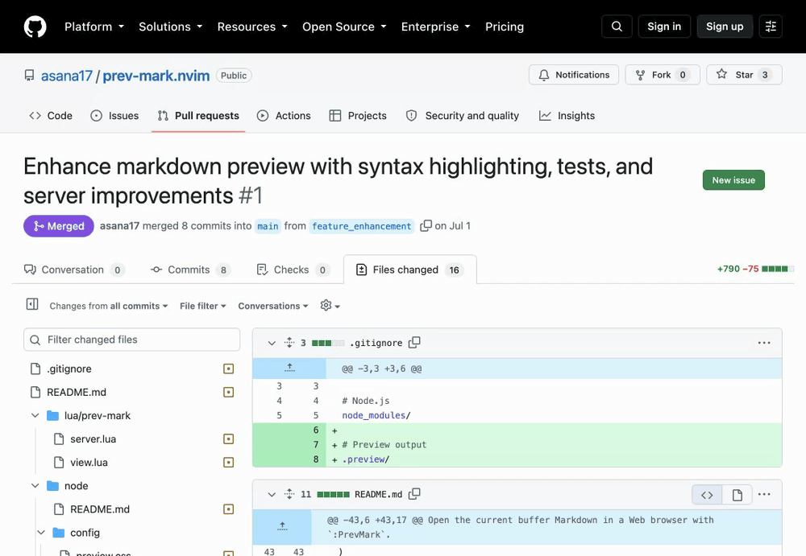

# GitHub PR Review Enhancement

A Chrome extension (Manifest V3) that collapses multi-line source-code comment blocks in GitHub pull-request diffs into a single line — so you review code, not comment walls.

## Features

- **Auto-collapses** runs of 2+ consecutive whole-line comments on page load — in both the classic (`/pull/N/files`) and next-gen (`/pull/N/changes`) GitHub diff UIs
- **Hover** a collapsed block for GitHub's native accent highlight; the full comment text is in the tooltip
- **Click** (or `Enter` / `Space`) to expand and re-collapse; a `+N` / `−N` badge shows how many lines are hidden
- **Language-aware** comment syntax picked from the file path/extension (see below)
- **Safe by design**: only lines whose trimmed text *starts* with a comment marker count — trailing comments, URLs and strings never trigger; JSON/CSV/TXT are never touched; Markdown `#` headings are never collapsed
- **Scroll-proof**: expanded blocks stay expanded while GitHub virtualizes rows in and out of view
- **Zero permissions**: no storage, no network access — just a content script and a stylesheet

## Install (unpacked)

1. Open `chrome://extensions`
2. Enable **Developer mode**
3. **Load unpacked** → select this folder
4. Open any pull request's *Files changed* tab

## Supported languages

| Comment style | Languages |
|---|---|
| `//` + `/* */` | JavaScript, TypeScript, JSX/TSX, Java, Kotlin, Scala, C, C++, C#, Objective-C, Go, Rust, Swift, Dart, PHP, Groovy, GraphQL, GLSL, … |
| `//` only | Zig, Pug |
| `#` | Python, Ruby, Shell, YAML, TOML, Nix, Elixir, Julia, Crystal, PowerShell, Terraform/HCL, Git ignore files, … (also by basename: `Makefile`, `Dockerfile`, `Gemfile`, …) |
| `--` | SQL, Lua, Haskell, Ada, VHDL, Lean, Idris, Agda |
| `;` | Clojure, Common Lisp, Emacs Lisp, Scheme, x86 asm, WAT, AutoHotkey |
| `%` | LaTeX, BibTeX, Erlang |
| `'` / `"` | VB/VBA, PlantUML / Vim script |
| `!` | Fortran, Xresources |
| `/* */` only | CSS, Sass/SCSS, Stylus |
| `<!-- -->` | HTML, XML, Markdown, Vue templates |
| blocks | OCaml `(* *)`, Pascal `{ }`, Twig `{# #}`, ERB/EJS `<%# %>`, Mermaid `%%`, batch `::` |
| never | JSON, JSONL, CSV, plain text |

Unknown extensions fall back to C-style (`//` + `/* */`), which only ever matches lines that *start* with those markers.

## Files

- `manifest.json` — MV3 manifest, content script on `https://github.com/*`
- `content.js` — language rules, diff scanning, grouping, expand/collapse
- `styles.css` — Primer-token styling for badges, hover, animation
- `demo.gif` — the recording above
